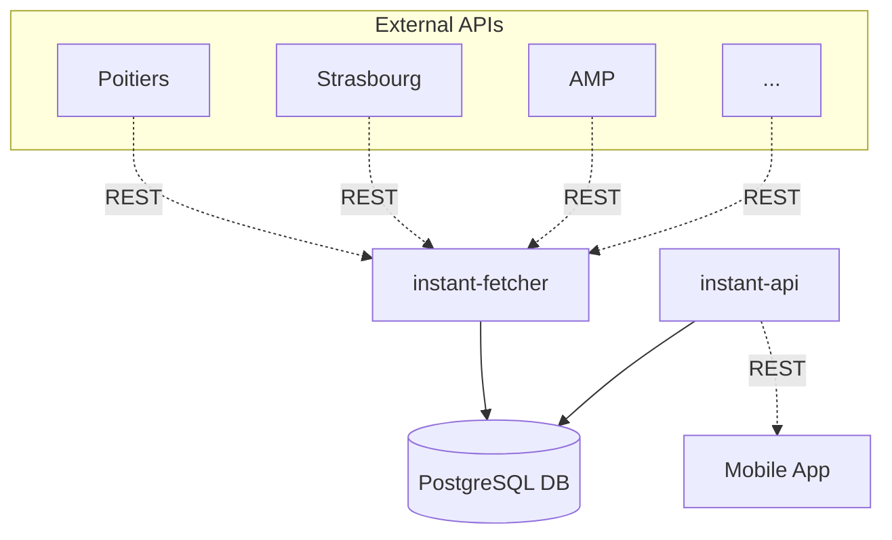

# Documentation

## Modules

There are 3 modules for 3 main features:

* Exposing data ([instant-api](instant-api))
* Persisting data ([instant-data](instant-data))
* Fetching data ([instant-fetcher](instant-fetcher))

## Database

The database schema is quite simple:

- A `City` contains multiple `ParkingLot`.
- A `ParkingLot` belongs to a `City`.

## Diagram

The architecture is basic (one might even call it "scholar"): I assumed the main goal was to assess my coding style and ability to deliver a working solution in a limited time.
This might not be the best solution for a production system, but it should be easy to understand and extend.



# How to run

## Prerequisites

- Java 25
- Docker (for PostgreSQL)

## Start the database

```shell
docker run --rm --name postgres -e POSTGRES_PASSWORD=postgres -e POSTGRES_USER=postgres -p 5432:5432 postgres
```

## Build and run the application

Compile the project:

```shell
./mvnw clean package
```


### Fetcher application

Application that will call the external APIs and store the parking lots (and cities) in the database.

```shell
java -jar ./instant-fetcher/target/instant-fetcher.jar
```

### API

Application exposing the REST API to get parking lots near a given location.

```shell
java -jar ./instant-api/target/instant-api.jar
```

Navigate to http://localhost:8080/api/swagger-ui/index.html or open the [Bruno collection](instant-bruno).

# Implementation choices

Disclaimer: I reused and adapted some code snippets from previous projects (e.g. AOP, REST service, ...) to save time.

## Global

* My first idea was to use configuration only to map the fields. It was working fine, but involved JSONPath management. I've used it in the past, it's great, really powerful, but
  can become really painful real fast.
* The occupation rate is calculated based on inputs (total/available space) instead of relying on the provided rate. This is done to standardize the output as some providers give
  0-100, others 0-1 scales, and all seem to provide available/total space -> to refine if needed.
* If the number of cities grows, use Kafka or similar to decouple the fetch operations from the persistence ones. Fetcher pushes to a queue, then x modules can be plugged in to handle the data differently (update db, refresh cache, push notifications, ...).
* Collections choices can be discussed (e.g. Set vs List), didn't put too much effort in figuring out the best choices here.
* Lack of input validation: this should definitely be a top priority (both on API and on fetcher/provider sides).
* Found the algorithm to calculate the distance between 2 points on [StackOverflow](https://stackoverflow.com/a/16794680)
* Not put too much effort on the side parts (e.g. logging, exception handling, tests) to focus on the main logic.
* No parallel / asynchronous processing, everything is synchronous and blocking for simplicity.
* I did not use the newly trending package-by-feature design, but the classic package-by-layer one for simplicity (and I don't think everyone's ready for it just yet).

## Fetching data ([instant-fetcher](instant-fetcher))

* This part could/should be split into multiple scheduled jobs (one per source). Here, out of simplicity, the choice is to run it as a long-running application that fetches data every X
  minutes (configurable per source, see [application.yml](instant-fetcher/src/main/resources/application.yml)). Decoupling would prevent global failures and finer monitoring/tuning.
* We could choose to read `JsonNode` instead of `ParkingLotsResponse`, it would involve writing mappers manually. As long the data needed is standard and not too complex, I think
  it's best to stick with POJOs and let Spring/Jackson do the resolution for us.
* Did not handle rate limit (status code 429) from providers, should be done in a production system.
* Configuration of the sources could/should be externalized (e.g. database, config server, ...).
* Used Java 25 but not any new cool feature from it 😭, just to be up-to-date.
* The AMP source is paged -> to implement

## Persisting data ([instant-data](instant-data))

* We may want to store the raw responses from the providers for debugging/audit purposes.
* Data model works, but should definitely be refined (index, constraints, relations, ...).
* Persisting coordinates as `String` (and not `double`): not used to work with such data, but I'm always worried about
  the [double precision](https://www.baeldung.com/java-double-precision-issue). When handling coordinates, precision is important. Storing as `String` and converting to `double`
  when
  needed seems safer to me even though it might not be as critical as payment systems.
* Used `ddl-auto: update` for simplicity, but in a production system, we MUST use a proper migration tool (e.g. Flyway, Liquibase, ...).

## Exposing data ([instant-api](instant-api))

* Add security.
* Add hateoas links if needed.
* The `/near` endpoint data can not be cached since each user will have a different location. But we could cache cities list or parking lots per city if needed.
* Caching is done at application level, but distributed cache would be a better fit.

# How to add a provider

1. Find the API documentation of the provider.
2. Create the source in [application.yml](instant-fetcher/src/main/resources/application.yml)
3. Create the POJOs to map the response.
4. Make the POJO response implement `ParkingLotsResponse`[ParkingLotsResponse.java](instant-fetcher/src/main/java/com/instant/fetcher/model/ParkingLotsResponse.java) interface.
5. Annotate the POJO response with `@ParkingLotsResponseFor(city = ...)`
6. Declare the new "city" in [SupportedCity.java](instant-fetcher/src/main/java/com/instant/fetcher/model/SupportedCity.java)
7. Restart